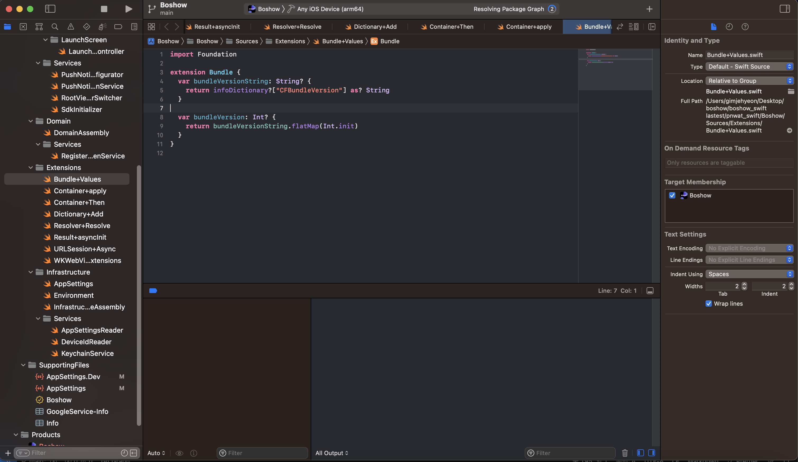
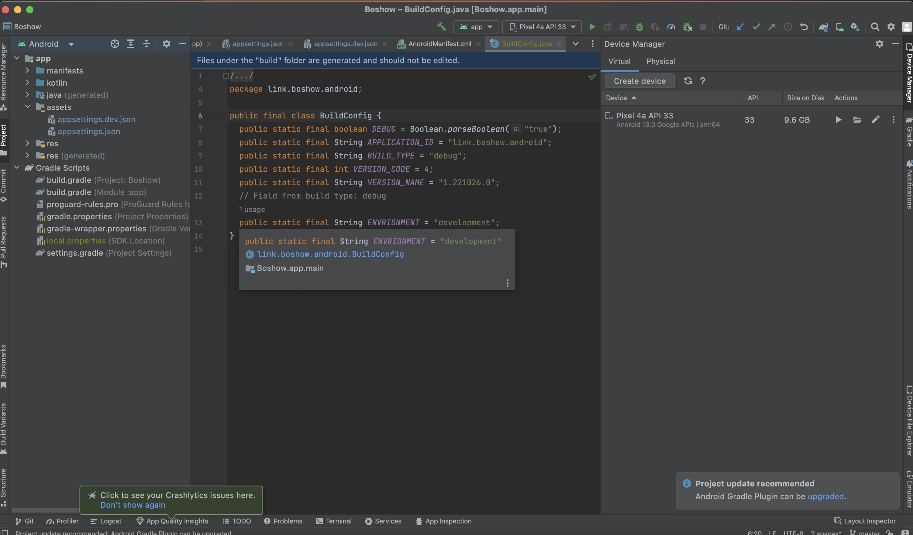
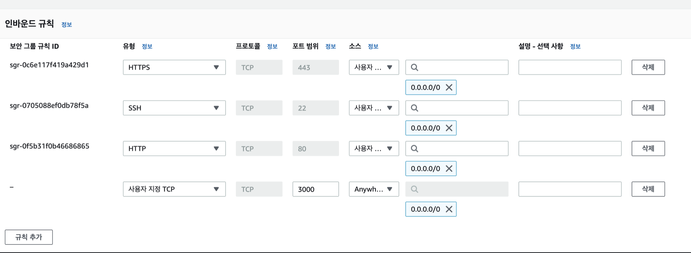
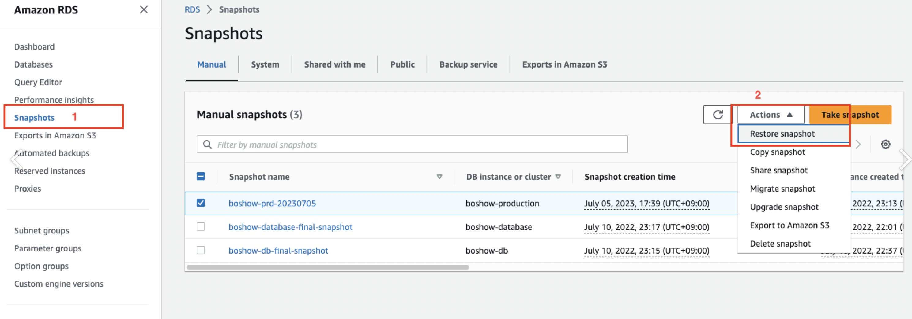
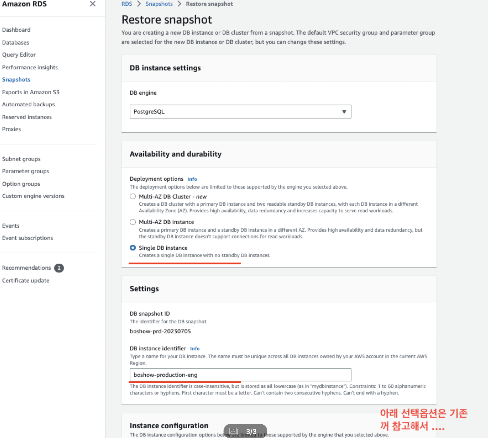
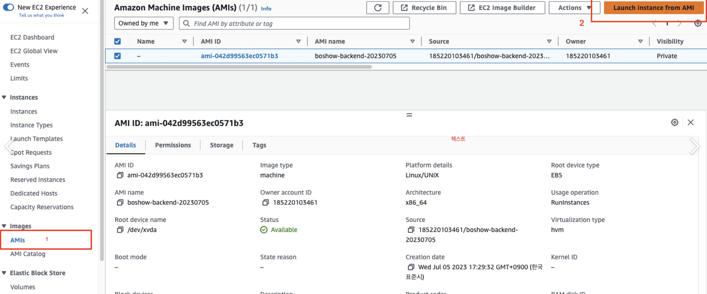
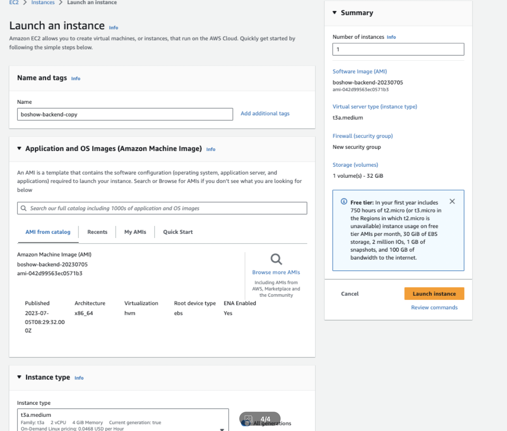

서버 구성 및 소프트웨어

- aws : ec2
- os : amazon Linux 2
- Language : Typescript
- Node Version : 16
- Backend : Strapi
- Frontend : Nextjs
- android : kotlin
- ios : swift
- db : rds

<br />
<br />

---

## 소스 코드 다운 받는 법

### 보쇼 알파 코드 소스 다운 받기 - 프론트

```bash
git clone https://github.com/ORIGINPNWAT/FE-Boshow-Alpha.git
```

### 보쇼 영어 코드 소스 다운 받기 - 프론트

```bash
git clone https://github.com/ORIGINPNWAT/FE-Boshow-EN.git
```

### 보쇼 코드 소스 다운 받기 - 프론트

```bash
git clone https://github.com/ORIGINPNWAT/boshow-backend.git
```

### 보쇼 코드 소스 다운 받기 - 백엔드

```bash
git clone https://github.com/ORIGINPNWAT/boshow-backend.git
```

### ios 보쇼 코드 소스 다운 받기

```bash
git clone https://github.com/ORIGINPNWAT/BoshowSwift.git
```

### android 보쇼 코드 소스 다운 받기

```bash
git clone https://github.com/ORIGINPNWAT/BoshowAndroid.git
```

### android 보쇼 코드 소스 다운 받기

```bash
git clone https://github.com/ORIGINPNWAT/RN-Boshow-2.0-Version.git
```

> 위 명령어를 치면 소스코드를 폴더에 내려 받아짐

<br />
<br />

---

## 백엔드 프로젝트 실행

1. git clone 후 소스코드 다운
2. 최상단 폴더에 .env 파일 추가
3. firebase/credential.json 파일을 추가
4. 최상단 폴더에서 npm install
5. 최상단 폴더에서 npm run build
6. 최상단 폴더에서 npm run start

> 백엔트 프로그램 로컬에서 테스트 환경으로 실행 완료

<br />
<br />

---

## 프론트엔드 프로젝트 실행

1. git clone 후 소스코드 다운
2. 최상단 폴더에 .env 파일 추가
3. 최상단 폴더에서 npm install
4. 최상단 폴더에서 npm run build
5. 최상단 폴더에서 npm run dev

> 프론트엔드 프로그램 로컬에서 테스트 환경으로 실행 완료

<br />
<br />

---

## 백엔드 코드 구조 간단 설명

- github
  - GitAction Workflow 관련 파일 담음
- config
  - 서버 및 데이터 베이스 설정 파일 삽입
  - admin key , 미들웨어 설정 , 플러그인 설정, 서버 설정 데이터 베이스 설정
- database
  - 데이터 베이스 migration을 위한 폴더
- firebase
  - Firebase Credentail를 위한 파일
- http
  - http 호출 테스트를 위한 파일 정의
- public
  - 정적 이미지 파일 포함
  - 로고 및 favicon를 포함
- script
  - CodeDeploy 시 실행될 Shell script 선언
- type
  - 각 타입 선언 파일
- util
  - 유튜브 섬네일 링크 탐색 등 기능에 관련된 함수 정의
- src
  - admin
    - admin 설정 및 커스터 마이징 관련 영역
    - 현재는 기본적인 언어 설정만 되어 있음
  - component
    - component 기능정의
  - extensions
    - 현재 사용된 sextensions 설정 및 관련 코드
  - middlewares
    - 공용 미들웨어 선언
  - api[각 모델 명]
    - controllers
      - router에서 참조할 handler를 선언하는 영역
    - middlewares
      - 해당 모델에서 사용할 미들웨어 선언
  - routes
    - api 엔드 포인트 설정
    - 코어 라우터를 설정
  - services
    - 모델의 비즈니스 로직 구현

<br />
<br />

---

## 프론트엔드 코드 구조 간단 설명

- .github
  - 깃허브 및 cicd관련 자동 배포 설정 파일이 들어가 있음
- .storybook
  - 컴포넌트 디자인 확인 라이브러리 설정 파일
- api
  - 백엔드와 연결할 때 시용하는 모든 함수 정의
- component
  - 프론트엔드에서 많이 사용되는 컴포넌트들을 선언해둔곳
  - atom - 가장 작은 단위
  - molecules - 2번째로 작은 단위
  - organisms - 3번째로 작은 단위
  - templates - 가장 큰 단위
- hook
  - 프론트엔드에서 사용하는 hooks를 정리해 선언한 폴더
- node_modules
  - 라이브러리 설치 파일
- pages
  - 프론트엔드에서 각 페이지들의 소스 코드가 담겨있는 파일
- public
  - 정적 이미지 파일이 모아져 있는 폴더
- Store
  - 전역 상태 관리 변수가 모여있는 곳
- stories
  - storybook 관련 세팅 파일
- type
  - 타입이 선언되어 있는 곳
- .env
  - 환경 변수 타입
- middleware.api.ts
  - 미들웨어가 정의된 파일
- ecosystem.config.js
  - pm2 배포때 실핼할 스크립트
- next.config.js
  - 넥스트 js 설정 파일
- tailwind.config.js
  - tailwind 설정 파일
- tsconfig.json
  - 타입스크립트 설정 파일

<br />
<br />

---

## ios 로컬에서 테스트 실행


왼쪽 상단 플레이 버튼 클릭 시 테스트 버전 빌드

<br />
<br />

---

## android 로컬에서 테스트 실행


오른쪽 상단에 플레이 버튼 클릭 시 테스트 버전 빌드

<br />
<br />

---

## 안드로이드 배포 방법

1. build.gradle(Module) 파일의 Version 정보 업데이트

2) 버전 정보 수정

- versionCode: 기존 값보다 큰 정수 설정(1단위로 수정하면 된다)

- versionName: 기존 값보다 크게 X.X.X 형식으로 설정

2. SyncNow 클릭

2) 앱 빌드

1. Generate Signed Bundle/APK ... 클릭

2. AAB(Android App Bundle)가 선택된 상태에서 NEXT 클릭

3. Key Store와 key 의 비밀번호를 입력후, NEXT를 클릭한다

- "Remember Passwrods" 는 가급적 체크하지 말자(자세한 내용은 아래 글 참고)

[안드로이드 앱] AAB 빌드 안될 때 해결 방법: keystore password was incorrect, getSecretKey failed: Password is not ASCII

4. release 가 선택된 상태에서 Finish 클릭

5. AAB 파일 확인

- 프로젝트폴더 > app > release 경로에 빌드된 AAB파일이 생성된다.

- 빌드 완료 후, Event Log 창에서 "locate"를 클릭하면 바로 해당 경로로 이동할 수 있다.

# 구글 플레이스토어에 업데이트 버전 배포 방법

버전 업데이트하여 생성한 AAB를 구글 플레이 스토어에 배포하는 방법을 정리한다.

1. 구글플레이 콘솔에 접속하고, 업데이트할 앱을 선택한다.

1) 구글플레이 콘솔 접속: https://play.google.com/console

2) 업데이트 할 앱 클릭

2. "프로덕션" 메뉴에서 "새버전 만들기"를 클릭한다.

1) "프로덕션" 메뉴 진입

2) "새버전 만들기" 클릭

3. AAB 업로드 / 버전 정보 설정 / 출시 노트 작성 / 저장

1) "업로드" 버튼을 클릭하여, 빌드해둔 AAB파일을 업로드 한다.

2) AAB파일을 업로드하면, AAB에서 추출된 정보가 표시된다.

3) 버전 정보를 확인한다.

4) 업데이트한 내용을 직접 적어준다.

5) 저장 버튼을 클릭한다

6) "버전 검토" 버튼이 활성화되면, 클릭한다.

7) "프로덕션 트랙으로 출시 시작" 버튼이 생성되면 클릭한다.

4. 완료

- 새로 업로드한 버전의 앱이 출시 검토중으로 노출되면 끝!

이제 구글 플레이스토어에서 업데이트 된 앱이 서비스 될 것이다.

(몇 시간 정도의 딜레이는 발생할 수 있다)

프로덕션 > 출시 대시보드에서도 방금 업로드한 최신 버전의 앱이 표기된다.

새 버전 앱 업데이트 출시 작업 완료!

아래 블로그 참고

```
https://curryyou.tistory.com/428
```

<br />
<br />

---

ios 배포

1. Product -> Archive. 시뮬레이터만 돌렸을 경우는 Archive 가 비활성화 될 수 있는데, 실제 기기를 통해서 한 번 빌드해주면 활성화 된다.

2. Distribute App 선택 -> App Store Connect 선택 -> Upload 선택 후 아카이브 기다리면 다음과 같은 창이 뜬다. 모두 선택.

3. Automatically manage signing 선택.

4. 앱 정보 확인 후 Upload

5. App Store Connect 에 업로드 완료

6. TestFlight 에 올라온 것 확인

아래 블로그 참고

```
https://velog.io/@heyksw/iOS-%EC%95%B1%EC%8A%A4%ED%86%A0%EC%96%B4-%EB%B0%B0%ED%8F%AC%EA%B3%BC%EC%A0%95
```

<br />
<br />

---

## 프론트엔드 복제하기



인스턴스 시작

이름 및 태그 : 원하는 이름
OS : Ununtu Server freetier
키페어 생성 : ✅ RSA (.pem)
방화벽 : ✅ 보안 그룹 생성
✅ 위치 무관 (접속 ip가 계속 변한다면)
✅ 인터넷에서 HTTPS 트래픽 허용
✅ 인터넷에서 HTTP 트래픽 허용 (백엔드 https 통신 구현이 안되어 있다면)
스토리지 구성 : 1x30 GiB gp2
인스턴스 생성

인스턴스 접속 후 아래 명령어 순서대로 입력

```bash
# 기본적인 우분투 업데이트
sudo apt-get update
curl -o- https://raw.githubusercontent.com/nvm-sh/nvm/v0.34.0/install.sh | bash
. ~/.nvm/nvm.sh
nvm install node

# 설치 확인작업
node -v
npm -v # npm은 node를 설치하면 따라 설치된다.
node -e "console.log('Running Node.js ' + process.version)"

git clone "[복제할 깃허브 프로젝트]"

# .env 수정
vi .env

# 의존성 설치
npm install

npm run build

npm run start

# 포트포워딩
sudo iptables -A PREROUTING -t nat -i eth0 -p tcp --dport 80 -j REDIRECT --to-port 3000

npm install pm2 -g

# 프로젝트 실행
pm2 start npm --name "next" -w -i max -- start
```

<br />
<br />

---

## 백엔드 , db복제 하기

1. 
2. 
3. 
4. 
5. 

```
위에 1~5번까지 차례대로 진행

db인스턴스 생성 시 옵션 (4가지 선택)
    - db.t3.micro 선택
    - 단일 데이터 베이스
    - 퍼블릭 엑세스 허용
    - 보안 그룹 : postgresql

backend 인스턴스 생성 시 옵션 (3가지 선택)
    - t2.small 선택
    - 보안 그룹 : http ,https 허용
    - 30GB gib 2
```

> 복제 완료

<br />

> 복제 이후 백엔드와 데이터 베이스 연결하는 방법

```bash
# backend 인스턴스 접속 후 .env파일을 수정 (생성한 rds 주소로 수정한다.)
vi .env

# 의존성 설정
npm install

# 빌드 파일 생성
npm run build

# 백엔드 서버 구동
pm2 start ecosystem.config.js
```

<br />
<br />

## 코드 수정 후 배포하기

```bash
# 백엔드나 프론트엔드 코드 수정 후 아래 명령어 입력으로 github에 소스 코드 올리기
git add .
git commit -m "commit"
git push origin production

# 깃허브 레파지토리에 코드가 잘 적용됐는 지 확인 후 aws에 접속
# aws 인스턴스 접속 후
git pull origin production
# 회사 계정과 토큰을 입력

pm2 kill
npm install
npm run build
pm2 start ecosystem.config.js
```

> 배포 완료


<br />
<br />

## 옴니커머스 키값 수정


```
src > api > product > controllers > product.ts 에서 위에 있는 key값을 새로 받은 key값으로 변경 후 aws배포
```


<br />
<br />

## rn 패키징

```
npm uninstall -g react-native-cli
brew install node
brew install watchman
brew tap homebrew/cask-versions
brew install --cask zulu11
brew tap AdoptOpenJDK/openjdk
brew install --cask adoptopenjdk8
rvm install "ruby-2.7.5"
sudo gem install cocoapods

## 프로젝트를 생성할 폴더로 이동 후 아래 명령어 실행
npx react-native init nativeTest --template react-native-template-typescript
cd nativeTest
cd ios
pod install
npx react-native run-ios

# 깃허브에 있는 rn src안에 있는 소스 코드 복붙

# 모든 폴더에 있는 package="com.boshowpnwatplswwwe" ---> 생성된 프로젝트 이름으로 바꿔야함 ex)com.reactTest
# 모든 폴더에 있는 target 'BoshowPnWatplswWWETests' ---> 생성된 프로젝트 이름으로 바꿔야함 ex)com.reactTest


```


## 버그 잡기

```
yarn ios --simulator="iPhone 14"

LaunchPackage.command가 터미널에서 문서를 열도록 허용되지 않았기 때문에 null을 열수 없습니다
- (nodemodules/react-native/scripts)에 가서 launchPackager.command를 우클릭 후 "항상 터미널로 열기"

react-native run-android
에러시 root폴더에서
 ->chmod 755 android/gradlew
```

```bash
warn Failed to connect to development server using "adb reverse": spawnSync adb ENOENT
info Starting the app...
error Failed to start the app.
Error: spawnSync adb ENOENT
# 위 에러 뜬다면
# 아래 설치
brew install --cask android-platform-tools
```


## 어플 이름 바꾸기

1. app.json 의 displayName 수정
2. android/app/src/main/res/values/strings.xml 코드를 수정합니다.
3. app_name 변수를 수동으로 변경해는 작업입니다. 변경하고 다시 코드 실행하면 앱이름 바뀌어 있습니다.

```xml
<resources>
	<string name="app_name">새로운 앱 이름</string>
</resources>
```

<br />

## 어플 사진 바꾸기

```bash
http://romannurik.github.io/AndroidAssetStudio/icons-launcher.html#foreground.type=image&foreground.space.trim=1&foreground.space.pad=0&foreColor=rgba(96%2C%20125%2C%20139%2C%200)&backColor=rgb(255%2C%20255%2C%20255)&crop=0&backgroundShape=circle&effects=none&name=ic_launcher_round

# 위 웹페이지에서 png다운 후 png파일 변경
android/app/src/main/res
  -mipmap-hdpi
  -mipmap-mdpi
  - ...
```

<br />

## apk파일 추출

- (1)

```bash
npx react-native bundle --platform android --dev false --entry-file index.js --bundle-output android/app/src/main/assets/index.android.bundle --assets-dest android/app/src/main/res/
```

- (2)

```bash
npx react-native run-android
```

- (3) 끝

```bash
android/app/build/outputs/apk/debug 경로에 있는 app-debug.apk
```

